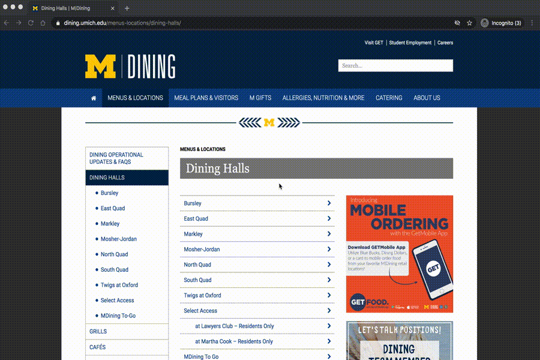

..  Copyright (C)  Brad Miller, David Ranum, Jeffrey Elkner, Peter Wentworth, Allen B. Downey, Chris
    Meyers, and Dario Mitchell.  Permission is granted to copy, distribute
    and/or modify this document under the terms of the GNU Free Documentation
    License, Version 1.3 or any later version published by the Free Software
    Foundation; with Invariant Sections being Forward, Prefaces, and
    Contributor List, no Front-Cover Texts, and no Back-Cover Texts.  A copy of
    the license is included in the section entitled "GNU Free Documentation
    License".

..  shortname:: Debugging
..  description:: Debugging activity.

.. setup for automatic question numbering.

.. qnum::
   :start: 1
   :prefix: debugging-

Code debugging activity
:::::::::::::::::::::::::

This code is supposed to scrape links for all the dining halls from the dining halls webpage. However, it doesn't work! Instead, it scrapes *every* link on the page. 

Can you fix it?

Below the code is a GIF that shows the relevant tags on the dining halls webpage.

.. activecode:: debug_code_1
        :language: python3
        :nocodelens:

        #Get the webpage
        # Load libraries for web scraping
        from bs4 import BeautifulSoup
        import requests
        # Get a soup from a URL 
        url = 'https://dining.umich.edu/menus-locations/dining-halls/'
        r = requests.get(url)
        soup = BeautifulSoup(r.content, 'html.parser')

        #Extract info from the webpage
        # Get first tag of a certain type from the soup
        first_tag = soup.find('div', class_='medium-7 columns')
        # Get all tags of a certain type from the first tag
        tags = soup.find_all('a')
        # Collect info from the tags
        collect_info = []
        for tag in tags:
            # Get link from tag
            info = tag.get('href')
            collect_info.append(info)

        #Do something with info
        # Print the info
        print(collect_info)

Relevant tags
**********************

