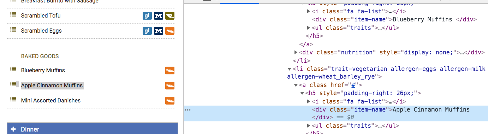

..  Copyright (C)  Brad Miller, David Ranum, Jeffrey Elkner, Peter Wentworth, Allen B. Downey, Chris
    Meyers, and Dario Mitchell.  Permission is granted to copy, distribute
    and/or modify this document under the terms of the GNU Free Documentation
    License, Version 1.3 or any later version published by the Free Software
    Foundation; with Invariant Sections being Forward, Prefaces, and
    Contributor List, no Front-Cover Texts, and no Back-Cover Texts.  A copy of
    the license is included in the section entitled "GNU Free Documentation
    License".

..  shortname:: Writing
..  description:: Writing activity.

.. setup for automatic question numbering.

.. qnum::
   :start: 1
   :prefix: writing-

Code writing activity
:::::::::::::::::::::::::

On this page, you will complete a series of activities to write the following scraping code:

Get all the menu items from the `Bursley hall web page <https://dining.umich.edu/menus-locations/dining-halls/bursley/>`_ and print them.

Here are a few images that show you how the Bursley hall web page works:

.. image:: _static/bursley_menu_items.gif
    :scale: 90%
    :align: center
    :alt: Inspecting Bursley menu items

Here is a close-up so you can see the tag of a menu item.

This tag is not used anywhere else on the page besides for menu items.

.. parsonsprob:: write_code_order_plans_goals
   
   Choose which of the following plans you will use, and put them in the correct order.
   
   -----
   Plan #2: Get a soup from a webpage
   =====
   Plan #3: Get a soup from multiple webpages#paired
   =====
   Plan #5: Get info from all tags of a certain type
   =====
   Plan #4: Get info from a single tag#paired
   =====
   Plan #6: Get info from all tags of a certain type, within another tag#paired
   =====
   Plan #9: Print info
   =====
   Plan #10: Store info in a json file#paired

.. parsonsprob:: write_code_order_plans_code

   Choose which of the following plans you will use, and put them in the correct order.   

   -----
   # Load libraries for web scraping
   from bs4 import BeautifulSoup
   import requests
   # Get a soup from a URL 
   url = _________________________
   r = requests.get(url)
   soup = BeautifulSoup(r.content, 'html.parser')   
   =====
   # Load libraries for web scraping
   from bs4 import BeautifulSoup
   import requests
   # Get a soup from multiple URLs 
   base_url = ________________________________
   endings =  ________________________________
   for ending in endings:
       url = base_url + ending 
       r = requests.get(url) 
       soup = BeautifulSoup(r.content, 'html.parser')#paired
   =====
   # Get all tags of a certain type from the soup
   tags = soup.find_all(___________)
   # Collect info from the tags
   collect_info = []
   for tag in tags:
       _______________________________________
       collect_info.append(info)
   =====
   # Get first tag of a certain type from the soup
   tag = soup.find(___________)
   # Get info from the tag
   _____________________________________________#paired
   =====
   # Get first tag of a certain type from the soup
   first_tag = soup.find(___________)
   # Get all tags of a certain type from the first tag
   tags = first_tag.find_all(____________)
   # Collect info from the tags
   collect_info = []
   for tag in tags: 
       ________________________________________
       collect_info.append(info)#paired
   =====
   # Print the info
   print(____________)
   =====
   # Load library for json files
   import json
   # Put info into file
   f = open(____________, 'w')
   json.dump(____________, f)
   f.close()#paired
   

.. reveal:: write_code_fill_in_reveal
    :showtitle: After you've tried this activity, you can click here.

    Now that you've assembled the correct plans, fill in the blanks to complete the code.

    .. activecode:: write_code_fill_in
       :language: python3
       :nocodelens:

        #Get the webpage
        # Load libraries for web scraping
        from bs4 import BeautifulSoup
        import requests
        # Get a soup from a URL 
        url = ______________________________________
        r = requests.get(url)
        soup = BeautifulSoup(r.content, 'html.parser')

        #Extract info from the webpage
        # Get all tags of a certain type from the soup
        tags = soup.find_all(________________)
        # Collect info from the tags
        collect_info = []
        for tag in tags:        
          _______________
          collect_info.append(info)
         
        #Do something with the info          
        # Print the info
        print(__________)
