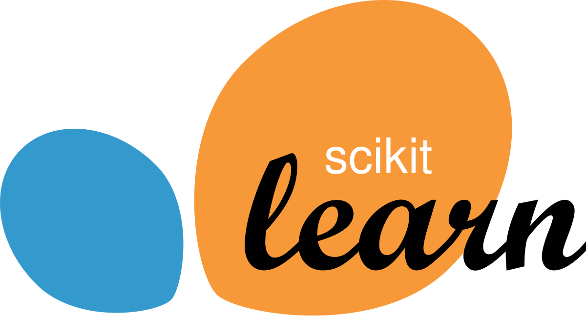

..  Copyright (C)  Brad Miller, David Ranum
    Permission is granted to copy, distribute and/or modify this document
    under the terms of the GNU Free Documentation License, Version 1.3 or
    any later version published by the Free Software Foundation; with
    Invariant Sections being Forward, Prefaces, and Contributor List,
    no Front-Cover Texts, and no Back-Cover Texts.  A copy of the license
    is included in the section entitled "GNU Free Documentation License".

=======================================
Machine Learning with Decision Trees
=======================================

.. randomnumberbox::

.. plandisplay:: plans.json
   :plan: Load Data

.. planexample:: my_combined_code
   :files: test.json,test.json

How this ebook works
::::::::::::::::::::

.. admonition:: This lesson will walk you through the steps of classifying penguins.

   We'll use a dataset of penguin species and their measurements to train a machine learning model. The model will predict the species of a penguin based on its measurements.

Classification with Decision Trees
::::::::::::::::::::::::::::::::::::::

.. toctree::
   :maxdepth: 1

   plan_1_1_LoadData.rst
   plan_1_2_CheckNaN.rst
   plan_1_2_FilterValues.rst
   plan_1_3_VisualizeDistribution.rst