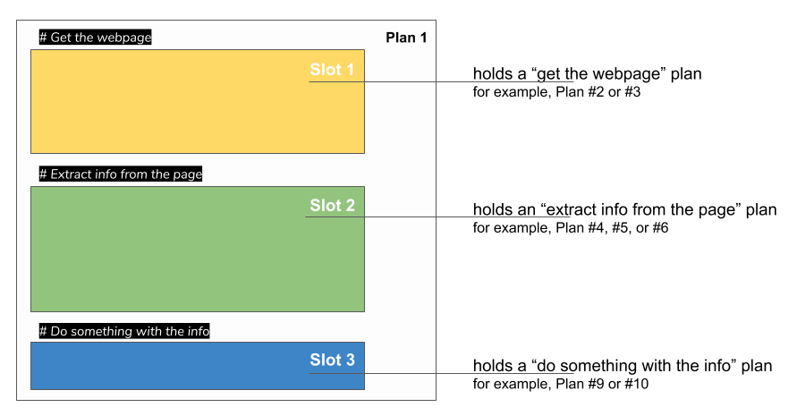

..  Copyright (C)  Brad Miller, David Ranum, Jeffrey Elkner, Peter Wentworth, Allen B. Downey, Chris
    Meyers, and Dario Mitchell.  Permission is granted to copy, distribute
    and/or modify this document under the terms of the GNU Free Documentation
    License, Version 1.3 or any later version published by the Free Software
    Foundation; with Invariant Sections being Forward, Prefaces, and
    Contributor List, no Front-Cover Texts, and no Back-Cover Texts.  A copy of
    the license is included in the section entitled "GNU Free Documentation
    License".

..  shortname:: Plan1
..  description:: Worked examples plus practice for Plan 1.

.. setup for automatic question numbering.

.. qnum::
   :start: 1
   :prefix: p1-

Plan 1: Example
====================================

Let's say that you want to make a list of all the Cottage Inn Pizza locations. When you go to their website, it turns out that there are a *lot* of locations. 

.. image:: _static/cottageinn_scroll.gif
    :scale: 70%
    :align: center
    :alt: Scrolling around the Cottage Inn locations page to see that there are a lot of locations

If only you could write a little Python to easily collect them all... 

It turns out that you can! 

.. activecode:: football_roster_3
   :language: python3
   :nocodelens:

   # Get the webpage
   # Load libraries for web scraping
   from bs4 import BeautifulSoup
   import requests
   # Get a soup from a URL 
   url = 'https://cottageinn.com/pick-a-location/'
   r = requests.get(url)
   soup = BeautifulSoup(r.content, 'html.parser')

   # Extract info from the page
   # Get all tags of a certain type from the soup
   tags = soup.find_all('h3')
   # Collect info from the tags
   collect_info = []
   for tag in tags:
      # Get text from tag
      info = tag.text
      collect_info.append(info)

   # Do something with the info
   # Print the info
   print(collect_info)

This code probably seems a bit complicated. In this ebook, we will break down web scraping into a few common "plans". Here is the first one:

Plan 1: Outline
====================================

Plan 1: Exercises
====================================

The exercise below doesn't really work. I need to replace it with something else. Maybe a select question.

.. dragndrop:: plan1_drag
    :feedback: This is feedback.
    :match_1: Get a soup from a webpage|||Get the webpage
    :match_2: Get a soup from multiple webpages|||Get the webpage
    :match_3: Get info from a single tag|||Get info from the webpage
    :match_4: Get info from all tags of a certain type|||Get info from the webpage
    :match_5: Get info from all tags of a certain type, within another tag|||Get info from the webpage
    :match_6: Print info|||Do something with the info
    :match_7: Save info in a json file|||Do something with the info

    Put the plans on the left into the slot they fit into on the right.

.. parsonsprob:: plan1_order

   Choose the subgoals that achieve **Scrape a webpage**, and put them in the right order.
   -----
   # Get the webpage
   =====
   # Extract info from the page 
   =====
   # Do something with the info
   =====
   # Soup the tags#distractor
   =====
   # Copy the info#distractor

