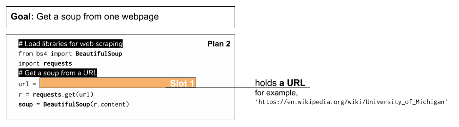
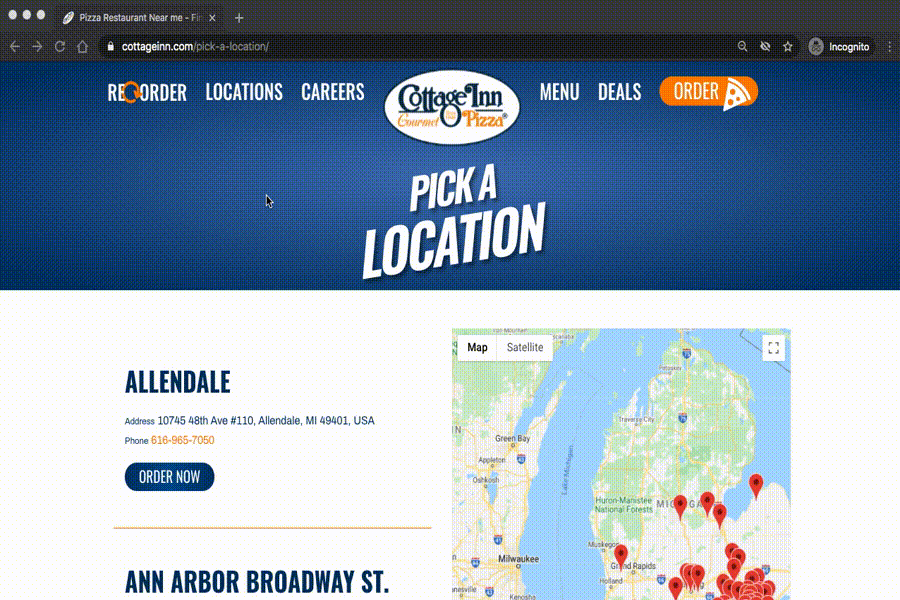

..  Copyright (C)  Brad Miller, David Ranum, Jeffrey Elkner, Peter Wentworth, Allen B. Downey, Chris
    Meyers, and Dario Mitchell.  Permission is granted to copy, distribute
    and/or modify this document under the terms of the GNU Free Documentation
    License, Version 1.3 or any later version published by the Free Software
    Foundation; with Invariant Sections being Forward, Prefaces, and
    Contributor List, no Front-Cover Texts, and no Back-Cover Texts.  A copy of
    the license is included in the section entitled "GNU Free Documentation
    License".

..  shortname:: Plan2
..  description:: Worked examples plus practice for Plan 2.

.. setup for automatic question numbering.

.. qnum::
   :start: 1
   :prefix: p2-

Plan 2: Example
====================================

The first step in web scraping is getting information from a webpage. 
To use the BeautifulSoup web scraping library, we have to put the webpage into something called a soup.

Here is the code for getting a **soup** from the **Cottage Inn location page**.

.. activecode:: cottage_plan2
   :language: python3
   :nocodelens:

   # Load libraries for web scraping
   from bs4 import BeautifulSoup
   import requests

   # Get a soup from a URL 
   url = 'https://cottageinn.com/pick-a-location/'
   r = requests.get(url)
   soup = BeautifulSoup(r.content, 'html.parser')

Plan 2: Outline
====================================

Here is what the plan looks like in general.

What is a URL?
====================================

A URL is a web address, like you see in your web browser. 
It should be complete (starting with http:// or https://). 
In this plan, a URL should be surrounded by quotes (:code:`' '`).

Plan 2: Exercises
====================================

.. clickablearea:: umich_plan2_click
    :question: If you wanted to get a soup from the MDen homepage, which part(s) of the code below would you change? Click on those parts of the code.
    :iscode:
    :feedback: Check out the plan outline above to identify the slot.

    # Load libraries for web scraping
    :click-incorrect:from bs4 import BeautifulSoup:endclick:
    :click-incorrect:import requests:endclick:

    # Get a soup from a URL 
    :click-incorrect:url =:endclick: :click-correct:'https://cottageinn.com/pick-a-location/':endclick:
    :click-incorrect:r = requests.get(url):endclick:
    :click-incorrect:soup = BeautifulSoup(r.content)::endclick:

.. fillintheblank:: plan2_fill

   Fill in the plan in order to get a soup from the University of Michigan wikipedia page.

   ``# Load libraries for web scraping``

   ``from bs4 import BeautifulSoup``

   ``import requests``

   ``# Get a soup from a URL`` 

   ``url =`` |blank|

   ``r = requests.get(url)``

   ``soup = BeautifulSoup(r.content, 'html.parser')``

   -    :'https://en.wikipedia.org/wiki/University_of_Michigan': Correct.  
        :https://en.wikipedia.org/wiki/University_of_Michigan: Remember that URLs in this plan should have quotes around them.
        :en.wikipedia.org/wiki/University_of_Michigan: Remember that URLs in this plan should start with https:// or http://
        :.*: Incorrect. 
        
.. parsonsprob:: plan2_parsons

   Choose the subgoals that achieve **Get a soup from a webpage**, and put them in the right order.
   -----
   # Load libraries for web scraping
   =====
   # Get a soup from a URL 
   =====
   # Send an html request #distractor
   =====
   # Get a soup from multiple URLs #distractor

 
