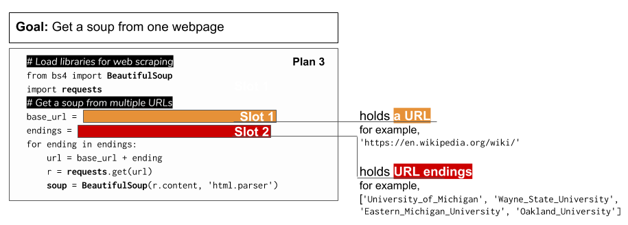

..  Copyright (C)  Brad Miller, David Ranum, Jeffrey Elkner, Peter Wentworth, Allen B. Downey, Chris
    Meyers, and Dario Mitchell.  Permission is granted to copy, distribute
    and/or modify this document under the terms of the GNU Free Documentation
    License, Version 1.3 or any later version published by the Free Software
    Foundation; with Invariant Sections being Forward, Prefaces, and
    Contributor List, no Front-Cover Texts, and no Back-Cover Texts.  A copy of
    the license is included in the section entitled "GNU Free Documentation
    License".

..  shortname:: Plan3
..  description:: Worked examples plus practice for Plan 3.

.. setup for automatic question numbering.

.. qnum::
   :start: 1
   :prefix: p3-

.. _plan_3:

Plan 3: Get a soup from multiple URLs
#####################################

Plan 3: Example
====================================

Sometimes we want to get information from multiple web pages that have the same layout. For example, all of the UMSI faculty pages have the same general design.

.. image:: _static/barbara-ericson.png
    :scale: 50%
    :align: center
    :alt: Plan 3 outline

.. image:: _static/steve-oney.png
    :scale: 50%
    :align: center
    :alt: Plan 3 outline

Maybe we are interested in getting information about mutliple UMSI professors: Dr. Barb Ericson, Dr. Steve Oney, and Dr. Paul Resnick. 

Their webpages are:

``https://www.si.umich.edu/people/barbara-ericson``

``https://www.si.umich.edu/people/steve-oney``

``https://www.si.umich.edu/people/paul-resnick``

In this code, we get a **soup** from multiple **UMSI faculty pages**.

.. raw:: html
   
   <pre><strong># Load libraries for web scraping</strong>
   <mark style="background-color:#FCF3CF;">from bs4 import BeautifulSoup
   import requests</mark></pre>

   <pre><strong># Get a soup from multiple URLs</strong>
   <mark style="background-color:#FCF3CF;">base_url = <mark style="border:2px; border-style:solid; border-color:#1A5276">'https://www.si.umich.edu/people/'</mark>
   endings = <mark style="border:2px; border-style:solid; border-color:#1A5276">['barbara-ericson', 'steve-oney', 'paul-resnick']</mark>
   for ending in endings:
       url = base_url + ending 
       r = requests.get(url) 
       soup = BeautifulSoup(r.content, 'html.parser')</mark></pre>

When to use this plan
====================================

Use this plan when you want to scrape the same thing from multiple webpages.

How to use this plan
====================================

**You should change**

If these are your URLs, what should your 

Plan 3: Exercises
====================================

If you want to also get the link to the most recent news item from Dean Tom Finholt's page, how would you change the code below? Dean Finholt's web page is ``https://www.si.umich.edu/people/thomas-finholt``.

Change the code and run it to see if you're right!

.. activecode:: plan3_edit_finholt
   :language: python
   :nocodelens:

   #Get the webpage
   # Load libraries for web scraping
   from bs4 import BeautifulSoup
   import requests
   # Get a soup from multiple URLs
   base_url = 'https://www.si.umich.edu/people/'
   endings = ['barbara-ericson', 'steve-oney', 'paul-resnick']
   for ending in endings:
       url = base_url + ending
       r = requests.get(url)
       soup = BeautifulSoup(r.content, 'html.parser')

       #Extract info from the page
       # Get first tag of a certain type from the soup
       tag = soup.find('a', class_='item-teaser--heading-link')
       # Get link from tag
       info = tag.get('href')  

       #Do something with the info
       # Print the info
       print(info)

Plan 3: Outline
====================================

