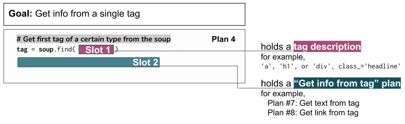

..  Copyright (C)  Brad Miller, David Ranum, Jeffrey Elkner, Peter Wentworth, Allen B. Downey, Chris
    Meyers, and Dario Mitchell.  Permission is granted to copy, distribute
    and/or modify this document under the terms of the GNU Free Documentation
    License, Version 1.3 or any later version published by the Free Software
    Foundation; with Invariant Sections being Forward, Prefaces, and
    Contributor List, no Front-Cover Texts, and no Back-Cover Texts.  A copy of
    the license is included in the section entitled "GNU Free Documentation
    License".

..  shortname:: Plan4
..  description:: Worked examples plus practice for Plan 4.

.. setup for automatic question numbering.

.. qnum::
   :start: 1
   :prefix: p4-

.. _plan_4:

Plan 4: Get info from a single tag
#####################################

Plan 4: Example
====================================

Maybe we want to get just one piece of information from a webpage. For example, maybe we want to get the "Most Helpful Comment" from Dr. Ericson's Rate My Professor page. 

Here's what we see when we use the "inspect" function in the browser. 

.. image:: _static/rate_my_prof.png
    :scale: 75%
    :align: center
    :alt: By inspecting that location, we see that it is a ``div`` tag with a ``class`` attribute.

It is a ``div`` tag with a ``class`` attribute. We need to get that tag, because its text has the information we want.

Here is how to get the "Most helpful comment":

.. activecode:: plan4_example
   :language: python3
   :nocodelens:

   # Get first tag of a certain type from the soup
   tag = soup.find('div', class_='Comments_StyledComments-dzzyvm-0 dvnRbr')
   
   # Get text from tag
   info = tag.text

Plan 4: Outline
====================================

Plan 4: Exercises
====================================

.. clickablearea:: umich_plan4_click
    :question: If you wanted to get a link from the first 'a' tag on a webpage, which part(s) of the code below would you change? Click on those parts of the code.
    :iscode:
    :feedback: Check out the plan outline above to identify the slot.

    :click-incorrect:# Get first tag of a certain type from the soup:endclick:
    :click-incorrect:tag = soup.find(:endclick::click-correct:'div'::endclick::click-correct:, class_='Comments_StyledComments-dzzyvm-0 dvnRbr'):endclick:
   
    :click-correct:# Get text from tag:endclick:
    :click-correct:info = tag.text:endclick:

Check out the image below, that inspects the description of the North Quad dining hall. 

.. image:: _static/nq_dining_onetag.png
    :scale: 70%
    :align: center
    :alt: The tag that creates the description of North Quad
        
.. parsonsprob:: plan4_parsons

   Choose the subgoals that get the text from the tag that has the description of the North Quad dining hall, and put them in the right order.
   -----
   # Get first tag of a certain type from the soup
   tag = soup.find('span', style='font-weight: 400;')
   =====
   # Get first tag of a certain type from the soup
   tag = soup.find('span') #paired
   =====
   # Get text from tag
   info = tag.text 
   =====
   # Get link from tag 
   info = tag.get('href') #distractor
   =====
   # Get all tags of a certain type from the soup
   tags = soup.find_all('p')#distractor

