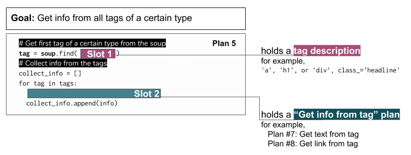
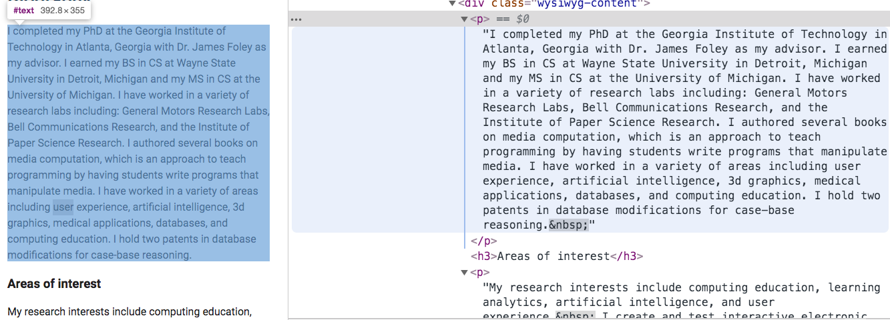

..  Copyright (C)  Brad Miller, David Ranum, Jeffrey Elkner, Peter Wentworth, Allen B. Downey, Chris
    Meyers, and Dario Mitchell.  Permission is granted to copy, distribute
    and/or modify this document under the terms of the GNU Free Documentation
    License, Version 1.3 or any later version published by the Free Software
    Foundation; with Invariant Sections being Forward, Prefaces, and
    Contributor List, no Front-Cover Texts, and no Back-Cover Texts.  A copy of
    the license is included in the section entitled "GNU Free Documentation
    License".

..  shortname:: Plan5
..  description:: Worked examples plus practice for Plan 5.

.. setup for automatic question numbering.

.. qnum::
   :start: 1
   :prefix: p5-

Plan 5: Example
====================================

To get information from the Cottage Inn locations page, we need to figure out which tags we should get from the soup, and what information we should get from the tags. 

A great way to figure this out is to use the "inspect" function on your browser. 

.. image:: _static/cottageinn_inspect.gif
    :scale: 90%
    :align: center
    :alt: By inspecting the locations, we see that they are all h3 tags.

We see that we need to get all the ``h3`` tags from the webpage. The text in those tags has the information we need!

.. activecode:: plan5_example
   :language: python3
   :nocodelens:

   # Get all tags of a certain type from the soup
   tags = soup.find_all('h3')
   
   # Collect info from the tags
   collect_info = []
   for tag in tags:
      # Get text from tag
      info = tag.text
      collect_info.append(info)

Plan 5: Outline
====================================

Plan 5: Exercises
====================================

Here's an example of some p tags on Dr. Ericson's UMSI website.

.. clickablearea:: plan5_click
    :question: If you wanted to get the text from all the p tags, which part(s) of the code below would you change?
    :iscode:
    :feedback: Check out the plan outline above to identify the relevant slot(s).

    # Get all tags of a certain type from the soup
    :click-incorrect:tags = soup.find_all(:endclick::click-correct:'h3':endclick::click-incorrect:):endclick:
   
    # Collect info from the tags
    :click-incorrect:collect_info = []:endclick:
    :click-incorrect:for tag in tags::endclick:
        :click-incorrect:# Get info from tag:endclick:
        :click-incorrect:info = tag.text:endclick:
        :click-incorrect:collect_info.append(info):endclick:

.. fillintheblank:: plan5_fill

   Fill in the plan in order to get the links from all *a* tags.

   ``# Get all tags of a certain type from the soup``

   ``tags = soup.find_all(`` |blank| ``)``
   
   ``# Collect info from the tags``

   ``collect_info = []``

   ``for tag in tags:``

      ``# Get info from tag``

      |blank|
      
      ``collect_info.append(info)``

   -    :'a': Correct.  
        :a: Remember that URLs in this plan should have quotes around them.
        :.*: Incorrect. 
   -    :tag.get('href'): Correct.
        :tag.text: Remember that you are trying to get the link.
        :tag.*: Incorrect, but good start!
        :.*: Incorrect.   

.. parsonsprob:: plan5_parsons

   Choose the subgoals that achieve **Get info from all tags of a certain type**, and put them in the right order.
   -----
   # Get all tags of a certain type from the soup
   =====
   # Collect info from the tags
   =====
   # Get info from the tag#distractor
   =====
   # Get first tag of a certain type from the soup#distractor
   =====
   # Get all tags of a certain type from the first tag#distractor

