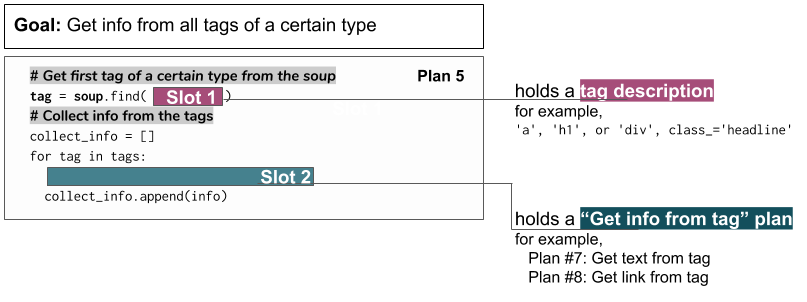

..  Copyright (C)  Brad Miller, David Ranum, Jeffrey Elkner, Peter Wentworth, Allen B. Downey, Chris
    Meyers, and Dario Mitchell.  Permission is granted to copy, distribute
    and/or modify this document under the terms of the GNU Free Documentation
    License, Version 1.3 or any later version published by the Free Software
    Foundation; with Invariant Sections being Forward, Prefaces, and
    Contributor List, no Front-Cover Texts, and no Back-Cover Texts.  A copy of
    the license is included in the section entitled "GNU Free Documentation
    License".

..  shortname:: Plan5
..  description:: Worked examples plus practice for Plan 5.

.. setup for automatic question numbering.

.. qnum::
   :start: 1
   :prefix: p5-

Plan 5: Example
====================================

.. image:: _static/cottageinn_inspect.gif
    :scale: 90%
    :align: center
    :alt: By inspecting the locations, we see that they are all h3 tags.

.. activecode:: umich_wiki_toc
   :language: python3
   :nocodelens:

   # Load libraries for web scraping
   from bs4 import BeautifulSoup
   import requests
   # Get a soup from a URL 
   url = 'https://en.wikipedia.org/wiki/University_of_Michigan'
   r = requests.get(url)
   soup = BeautifulSoup(r.content, 'html.parser')

   # Get all tags of a certain type from the soup
   tags = soup.find_all('span', class_ = 'toctext')
   # Collect info from the tags
   collect_info = []
   for tag in tags:
       # Get text from tag
       info = tag.text
       collect_info.append(info)

   # Do something with info
   # Print the info
   print(collect_info)

Some more tags
====================================

Plan 5: Outline
====================================

Goal: 

Plan 5: Exercises
====================================

This is filler text.

.. dragndrop:: dnd
    :feedback: This is feedback.
    :match_1: Drag me to 1|||I am 1
    :match_2: Drag me to 2|||I am 2
    :match_3: Drag me to 3|||I am 3

    This is a drag n drop question.

.. dragndrop:: orde
    :feedback: This is feedback.
    :match_1: Plan #10 ||| # Get the webpage
    :match_2: Plan #4 ||| # Extract info from the page
    :match_3: Plan #3 ||| # Do something with the info

    This is a drag n drop question.

