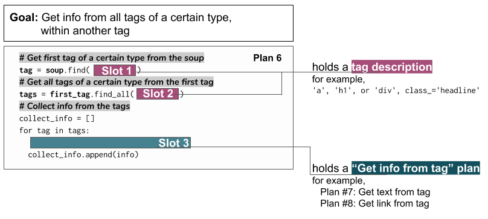

..  Copyright (C)  Brad Miller, David Ranum, Jeffrey Elkner, Peter Wentworth, Allen B. Downey, Chris
    Meyers, and Dario Mitchell.  Permission is granted to copy, distribute
    and/or modify this document under the terms of the GNU Free Documentation
    License, Version 1.3 or any later version published by the Free Software
    Foundation; with Invariant Sections being Forward, Prefaces, and
    Contributor List, no Front-Cover Texts, and no Back-Cover Texts.  A copy of
    the license is included in the section entitled "GNU Free Documentation
    License".

..  shortname:: Plan6
..  description:: Worked examples plus practice for Plan 6.

.. setup for automatic question numbering.

.. qnum::
   :start: 1
   :prefix: p6-

.. _plan_6:

Plan 6: Get info from all tags of a certain type, within another tag
#########################################################################

Sometimes, we get to get some information from only one part of the webpage. It might be that the type of tag that has information we want shows up in multiple parts of the page, but we only care about one part.

For example, maybe we want to get links from the "sidecard" of a wikipedia page, instead of links from the whole page. If we inspect the sidecard, we see that there is a tag that represents the entire sidecard.

.. image:: _static/wiki_sidecard.png
    :scale: 90%
    :align: center
    :alt: Getting links from the wikipedia sidecard

Plan 6: Example
====================================

Here is how we get links from just the "sidecard" of the wikipedia page.

.. activecode:: wiki_sidecard
   :language: python3
   :nocodelens:

   # Get first tag of a certain type from the soup
   first_tag = soup.find('table', class_='infobox vcard')
   # Get all tags of a certain type from the first tag
   tags = first_tag.find_all('a')
   # Collect info from the tags
   collect_info = []
   for tag in tags:
       # Get link from tag
       info = tag.get('href')
       collect_info.append(info)

Plan 6: Outline
====================================

Plan 6: Exercises
====================================

.. parsonsprob:: plan6_parsons

   Choose the subgoals that achieve **Get info from all tags of a certain type, within another tag**, and put them in the right order.
   -----
   # Get first tag of a certain type from the soup
   =====
   # Get all tags of a certain type from the soup#distractor
   =====
   # Get all tags of a certain type from the first tag
   =====
   # Collect info from the tags
   =====
   # Get info from the tag#distractor

