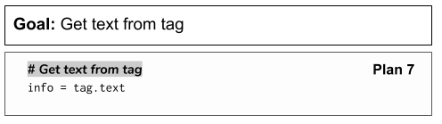

..  Copyright (C)  Brad Miller, David Ranum, Jeffrey Elkner, Peter Wentworth, Allen B. Downey, Chris
    Meyers, and Dario Mitchell.  Permission is granted to copy, distribute
    and/or modify this document under the terms of the GNU Free Documentation
    License, Version 1.3 or any later version published by the Free Software
    Foundation; with Invariant Sections being Forward, Prefaces, and
    Contributor List, no Front-Cover Texts, and no Back-Cover Texts.  A copy of
    the license is included in the section entitled "GNU Free Documentation
    License".

..  shortname:: Plan7
..  description:: Worked examples plus practice for Plan 7.
   
.. setup for automatic question numbering.

.. qnum::
   :start: 1
   :prefix: p7-

.. _plan_7:

Plan 7: Get text from tag
###########################

Behind every webpage is HTML code. HTML code is made up of *tags*.

There are many types of tags. Some examples from the are below.

Plan 7: Example
====================================

Here is the tag that creates the name of one of the Cottage Inn Pizza locations. The tag is surrounded by the blue rectangle. It is an h3 tag.

.. image:: _static/cottage_inn_h3_text.png
    :scale: 90%
    :align: center
    :alt: h3 tag example

By using the code below, we can get the **text** of the tag. The text is what is in-between the start and end tag (between the ``<h3>`` and ``</h3>``. For the image above, the text is **Ann Arbor Broadway St.**

.. activecode:: plan7
   :language: python
   :nocodelens:

   # Get text from tag
   info = tag.text

Plan 7: Outline
====================================

Plan 7: Exercises
====================================

.. mchoice:: get_text_mc_1
    :random:

    What is the text of the tag below?

    .. image:: _static/dining_h2_text.png
        :align: center
        :alt: h2 tag on dining page
    
    -   Today's Menu

        +   Correct! This text is between the <h2> and </h2>

    -   h2

        -   No, h2 is the tag name.

    -   menuTitle

        -   No

    -   class

        -   No, class is an attribute

.. mchoice:: get_text_mc_2
    :random:

    Which tag in the picture below has text?

    .. image:: _static/dining_span_text.png
        :align: center
        :alt: span tag on dining page

    -   'h2'

        -   No, there is no h2 tag in this image.

    -   span, style='font-weight: 400;'

        +   Correct! The text starts with "With its chandeliers and dramatically vaulted ceiling..."

    -   'p'

        -   No, this tag contains the span tag.

    -   'style'

        -   No, style is an attribute
 

