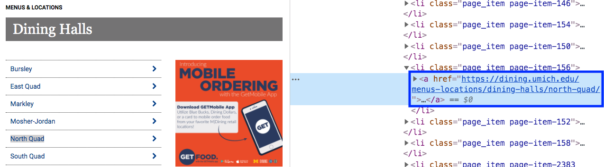
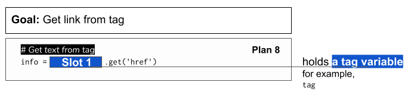

..  Copyright (C)  Brad Miller, David Ranum, Jeffrey Elkner, Peter Wentworth, Allen B. Downey, Chris
    Meyers, and Dario Mitchell.  Permission is granted to copy, distribute
    and/or modify this document under the terms of the GNU Free Documentation
    License, Version 1.3 or any later version published by the Free Software
    Foundation; with Invariant Sections being Forward, Prefaces, and
    Contributor List, no Front-Cover Texts, and no Back-Cover Texts.  A copy of
    the license is included in the section entitled "GNU Free Documentation
    License".

..  shortname:: Plan8
..  description:: Worked examples plus practice for Plan 8.

.. setup for automatic question numbering.

.. qnum::
   :start: 1
   :prefix: p8-

.. _plan_8:

Plan 8: Get link from tag
###########################

One type of tag, the ``a`` tag, holds a link. 

Plan 8: Example
====================================

Here is the tag that creates the link to the North Quad dining hall page.It is an 'a' tag.

By using the code below, we can get the **link** from the tag. The link is what comes after the ``href=``. For the tag above, the link is **https://dining.umich.edu/menus-locations/dining-halls/north-quad/**

.. activecode:: plan8_example
    :language: python3
    :nocodelens:

    # Get link from tag
    info = tag.get('href')

Plan 8: Outline
====================================

Plan 8: Exercises
====================================

.. mchoice:: get_link_mc_1
    :random:

    What is the link of the tag below?

    .. image:: _static/barb_link.png
        :align: center
        :alt: Link to Barb's page
    
    -   https://www.si.umich.edu/people/barbara-ericson

        -   No, this is the full link, but there is a relative link in the tag. 

    -   /people/barbara-ericson

        +   Correct!

    -   a

        -   No, this is the name of the tag

    -   Barbara Ericson

        -   No, this is the text of the tag

.. fillintheblank:: get_link_fill

    What is the code to get a link from a tag? (What is plan 8?)

    |blank|

    -    :info = tag.get('href'): Correct.  
         :info = tag.get("href"): Correct.
         :.*: Check out the plan outline for help.

