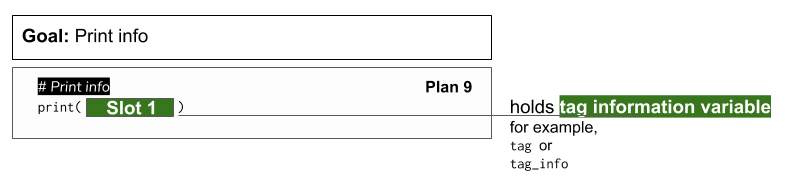

..  Copyright (C)  Brad Miller, David Ranum, Jeffrey Elkner, Peter Wentworth, Allen B. Downey, Chris
    Meyers, and Dario Mitchell.  Permission is granted to copy, distribute
    and/or modify this document under the terms of the GNU Free Documentation
    License, Version 1.3 or any later version published by the Free Software
    Foundation; with Invariant Sections being Forward, Prefaces, and
    Contributor List, no Front-Cover Texts, and no Back-Cover Texts.  A copy of
    the license is included in the section entitled "GNU Free Documentation
    License".

..  shortname:: Plan9
..  description:: Worked examples plus practice for Plan 9.

.. setup for automatic question numbering.

.. qnum::
   :start: 1
   :prefix: p9-

.. _plan_9:

Plan 9: Print info
###########################

It's very common to print the information you have just scraped.

Plan 9: Example
====================================

If you want to print info from only one tag, like if you've just used *Plan 4: Get info from a single tag*, then do this:

.. activecode:: plan9_example_1
    :language: python3
    :nocodelens:

    print(info)

If you want to print info from only one tag, like if you've just used *Plan 5: Get info from all tags of a certain type*, or *Plan 6: Get info from all tags of a certain type, within another tag*, then do this:

.. activecode:: plan9_example_2
    :language: python3
    :nocodelens:

    print(collect_info)

Plan 9: Outline
====================================

Goal: 

Plan 9: Exercises
====================================

.. fillintheblank:: plan9_fill_in

   Here is the code to collect all the locations from the Cottage Inn locations page. 
   
   What should fill the slot in Plan 10 below?

   .. code-block:: python 

           #Get the webpage
           # Load libraries for web scraping
           from bs4 import BeautifulSoup
           import requests
           # Get a soup from a URL 
           url = 'https://cottageinn.com/pick-a-location/'
           r = requests.get(url)
           soup = BeautifulSoup(r.content, 'html.parser')

           #Extract info from the page
           # Get all tags of a certain type from the soup
           tags = soup.find_all('h3')
           # Collect info from the tags
           collect_info = []
           for tag in tags:
               # Get text from tag
               info = tag.text
               collect_info.append(info)

   ``#Do something with the info``

   ``# Print the info``
   
   ``print(`` |blank| ``)``

   -    :get_info: Correct.  
        :info: Remember that the variable that goes in this plan depends on the plan above.
        :.*: Incorrect. 
 

