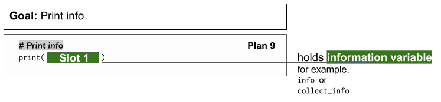

..  Copyright (C)  Brad Miller, David Ranum, Jeffrey Elkner, Peter Wentworth, Allen B. Downey, Chris
    Meyers, and Dario Mitchell.  Permission is granted to copy, distribute
    and/or modify this document under the terms of the GNU Free Documentation
    License, Version 1.3 or any later version published by the Free Software
    Foundation; with Invariant Sections being Forward, Prefaces, and
    Contributor List, no Front-Cover Texts, and no Back-Cover Texts.  A copy of
    the license is included in the section entitled "GNU Free Documentation
    License".

..  shortname:: Plan9
..  description:: Worked examples plus practice for Plan 9.

.. setup for automatic question numbering.

.. qnum::
   :start: 1
   :prefix: p9-

Plan 9: Example
====================================

.. activecode:: plan8_example_1
    :language: python3
    :nocodelens:

    print(info)

.. activecode:: plan8_example_2
    :language: python3
    :nocodelens:

    print(collect_info)

Plan 9: Outline
====================================

Goal: 

Plan 9: Exercises
====================================

This is filler text.

Exercises should involve putting things together with plans 4-6

